# CODE BD CODE Backend API

> A scalable, feature-rich RESTful backend API for an **Interactive Programming Learning Platform** built with **Node.js, Express.js, TypeScript, Prisma, PostgreSQL, Redis, and SSLCommerz/bKash**.

---

CODE BD CODE is an interactive programming learning platform designed to train software engineers. Beyond traditional video and text lessons, it provides an end-to-end interactive learning environment featuring structured course hierarchies, interactive coding challenges, automated quizzes, assignment workflows, and integrated payment processing.

The system enforces strict **Role-Based Access Control (RBAC)** across three primary user roles:

* 👨‍🎓 **Student:** Browse courses, enroll, track progress, attempt quizzes, submit coding solutions, complete assignments, and claim certificates upon completion.
* 👨‍🏫 **Teacher:** Create and manage courses, design curriculum hierarchies (SuperModules, Modules, Lessons), author coding problems/quizzes, and grade student assignments.
* 👨‍💼 **Admin:** Manage platform users, manage teachers, moderate courses and reviews, monitor transaction history, view audit logs, and access analytics dashboards.

---

# 🚀 Live Links

| Resource | Link |
| --- | --- |
| 🌐 Live API | [https://code-bd-code-backend.vercel.app/](https://code-bd-code-backend.vercel.app/) |
| 📮 Postman Documentation | [https://documenter.getpostman.com/view/52004920/2sBYB1MTLY](https://documenter.getpostman.com/view/52004920/2sBYB1MTLY) |
| 💻 GitHub Repository | [https://github.com/mahfahim/interactive-programming-learning-platform-backend](https://github.com/mahfahim/interactive-programming-learning-platform-backend) |

---

# 👨‍💼 Admin Credentials

```text
Email:
admin@devsphere.com

Password:
123456

```

---

# ✨ Features

## Authentication & Security

* **JWT Authentication:** Access token and HTTP-only cookie refresh token flow managed via Redis.
* **Social Auth:** GCP Google OAuth 2.0 integration.
* **RBAC:** Fine-grained role-based access control (`STUDENT`, `TEACHER`, `ADMIN`).
* **Security Middlewares:** Password hashing with `bcrypt`, `helmet` HTTP headers, CORS policies, rate-limiting, and request context tracking.

## Course & Content Management

* **Hierarchical Curriculum Structure:** Courses $\rightarrow$ Super Modules $\rightarrow$ Modules $\rightarrow$ Lessons.
* **Diverse Lesson Types:** Support for Video, Article, Coding Problem, Quiz, and Assignment lessons.
* **Lesson Locking & Prerequisites:** Sequential access unlocking based on progress completion.
* **Search, Filter & Pagination:** Full-text search, level-based filtering, and page-based queries.

## Interactive Assessment & Submissions

* **Coding Engine Integration:** External Judge0 API integration for automated test-case execution with memory and time-limit tracking.
* **Dynamic Quiz Engine:** Multi-choice questions with real-time scoring, attempt history, and passing criteria checks.
* **Assignment Submissions:** GitHub repository submission workflow with instructor grading and score tracking.

## Progress, Certification & Payments

* **Progress Tracking & Caching:** Granular progress calculation backed by Redis cache strategy.
* **Certificate Generation:** Automated issuance of unique verifiable certificates upon 100% course completion.
* **Payment Gateway Integration:** Tokenized bKash Checkout and SSLCommerz payment integration with validation webhooks.
* **Email & Media Management:** Nodemailer templates for transactional emails and Cloudinary for file asset management.
* **Audit Logging:** System-wide tracking of sensitive actions and entity state changes.

---

# 🛠 Tech Stack

## Core Backend

* **Framework:** Express.js with TypeScript (`tsup` builder)
* **Database & ORM:** PostgreSQL & Prisma ORM
* **Caching & Memory Database:** Redis
* **Authentication:** JWT, bcrypt, Google OAuth (GCP)
* **Validation:** Zod schema validation

## External Integrations & Services

* **Code Execution:** Judge0 API Engine
* **Payment Gateways:** bKash Checkout API, SSLCommerz
* **Media Storage:** Cloudinary
* **Email Service:** Nodemailer with EJS Templating
* **Deployment:** Render / Vercel, Managed PostgreSQL Cloud

---

# 📂 Folder Structure

```text
INTERACTIVE-PROGRAMMING-LEARNING-PLATFORM-BACKEND/
│
├── prisma/
│   ├── seed.ts
│   │
│   └── schema/
│       ├── assessment.prisma
│       ├── AuditLog.prisma
│       ├── certificate.prisma
│       ├── coding.prisma
│       ├── common.prisma
│       ├── course.prisma
│       ├── discussion.prisma
│       ├── enrollment.prisma
│       ├── enums.prisma
│       ├── identity.prisma
│       ├── payment.prisma
│       ├── quiz.prisma
│       └── schema.prisma
│
├── src/
│   ├── app.ts
│   ├── server.ts
│   │
│   ├── app/
│   │   ├── config/
│   │   │   └── index.ts
│   │   │
│   │   ├── interfaces/
│   │   │   └── index.ts
│   │   │
│   │   ├── lib/
│   │   │   ├── bkash.ts
│   │   │   ├── cloudinary.ts
│   │   │   ├── googleAuth.ts
│   │   │   ├── multer.ts
│   │   │   ├── nodemailer.ts
│   │   │   ├── prisma.ts
│   │   │   ├── redis.ts
│   │   │   └── sslcommerz.ts
│   │   │
│   │   ├── middlewares/
│   │   │   ├── checkAuth.ts
│   │   │   ├── globalErrorHandler.ts
│   │   │   ├── notFound.ts
│   │   │   ├── rateLimiter.ts
│   │   │   ├── requestContext.ts
│   │   │   └── validateRequest.ts
│   │   │
│   │   ├── modules/
│   │   │   ├── analytics/
│   │   │   ├── assignment/
│   │   │   ├── auditLog/
│   │   │   ├── auth/
│   │   │   ├── certificate/
│   │   │   ├── course/
│   │   │   ├── discussion/
│   │   │   ├── enrollment/
│   │   │   ├── judge/
│   │   │   ├── lesson/
│   │   │   ├── module/
│   │   │   ├── payment/
│   │   │   ├── quiz/
│   │   │   ├── superModule/
│   │   │   └── user/
│   │   │
│   │   ├── templates/
│   │   │   ├── forgot-password.ejs
│   │   │   ├── registration-user-otp.ejs
│   │   │   ├── reset-password-success.ejs
│   │   │   └── user-welcome-email.ejs
│   │   │
│   │   └── utils/
│   │       ├── AppError.ts
│   │       ├── asyncLocalStorage.ts
│   │       ├── cache.ts
│   │       ├── cacheKey.ts
│   │       ├── catchAsync.ts
│   │       ├── checkProAccess.ts
│   │       ├── cloudinaryUpload.ts
│   │       ├── courseLessonAssertions.ts
│   │       ├── jwt.ts
│   │       ├── sanitizeAuditData.ts
│   │       └── sendResponse.ts
│   │
│   └── generated/
│       └── prisma/
│
├── .env
├── .gitignore
├── package.json
├── package-lock.json
├── prisma.config.ts
├── tsconfig.json
├── tsup.config.ts
└── README.md

```

---

# ⚙️ Installation

## Clone Repository

```bash
git clone https://github.com/mahfahim/DevSphere-backend.git
cd DevSphere-backend

```

---

## Install Dependencies

```bash
npm install

```

---

## Environment Variables

Create a `.env` file in the root directory matching your `src/config/index.ts`:

```env
NODE_ENV=development
# NODE_ENV="production"

DATABASE_URL="your_database_connection_url"
DIRECT_URL="your_direct_database_connection_url"

PORT=5000
# FRONTEND_URL="your_local_frontend_url"
# FRONTEND_URL="your_production_frontend_url"
FRONTEND_URL="your_frontend_url"
BACKEND_URL="your_backend_url"

BCRYPT_SALT_ROUNDS=12
JWT_SECRET="your_jwt_secret_key"
JWT_REFRESH_SECRET="your_jwt_refresh_secret_key"
JWT_ACCESS_EXPIRES_IN="1d"
JWT_REFRESH_EXPIRES_IN="7d"

GOOGLE_CLIENT_ID="your_google_client_id"

# Created by Vercel CLI
VERCEL_OIDC_TOKEN="your_vercel_oidc_token"

REDIS_USER="your_redis_user"
REDIS_PASSWORD="your_redis_password"
REDIS_HOST="your_redis_host"
REDIS_PORT=6379

SMTP_USER="your_smtp_email"
SMTP_PASSWORD="your_smtp_password"
EMAIL_SENDER="your_sender_email"

CLOUDINARY_CLOUD_NAME="your_cloud_name"
CLOUDINARY_API_KEY="your_api_key"
CLOUDINARY_API_SECRET="your_api_secret"

# BKASH_BASE_URL="your_bkash_sandbox_url"
BKASH_BASE_URL="your_bkash_live_url"
BKASH_USERNAME="your_bkash_username"
BKASH_PASSWORD="your_bkash_password"
BKASH_APP_KEY="your_bkash_app_key"
BKASH_APP_SECRET="your_bkash_app_secret"

# SSLCommerz
SSL_STORE_ID="your_ssl_store_id"
SSL_STORE_PASSWORD="your_ssl_store_password"
SSL_IS_LIVE=false
SSL_PAYMENT_API="your_ssl_payment_api_url"
SSL_VALIDATION_API="your_ssl_validation_api_url"

# Judge0 API Configurations
JUDGE0_API_URL="your_judge0_api_url"
JUDGE0_HOST="your_judge0_host"
JUDGE0_KEY="your_judge0_api_key"

```

---

## Generate Prisma Client

```bash
npx prisma generate

```

---

## Run Migrations

```bash
npx prisma migrate dev

```

---

## Seed Database

```bash
npm run seed

```

---

## Run Development Server

```bash
npm run dev

```

---

## Build Project

```bash
npm run build

```

---

## Run Production Server

```bash
npm start

```

---

# 📚 API Endpoints

## Authentication

| Method | Endpoint | Description |
| --- | --- | --- |
| `POST` | `/api/v1/auth/register` | Register a new user account |
| `POST` | `/api/v1/auth/login` | Authenticate user & issue tokens |
| `POST` | `/api/v1/auth/refresh-token` | Obtain a new access token using refresh token |
| `GET` | `/api/v1/auth/google` | Trigger Google GCP OAuth flow |
| `GET` | `/api/v1/auth/me` | Fetch authenticated user details |
| `PATCH` | `/api/v1/auth/me` | Update authenticated user profile |
| `POST` | `/api/v1/auth/logout` | Revoke session and clear cookies |

---

## Courses & Curriculum

| Method | Endpoint | Description |
| --- | --- | --- |
| `GET` | `/api/v1/courses` | List courses (Supports pagination, search, filter) |
| `GET` | `/api/v1/courses/:id` | Get details of a specific course |
| `POST` | `/api/v1/courses` | Create a new course (Teacher/Admin) |
| `PATCH` | `/api/v1/courses/:id` | Update course details |
| `DELETE` | `/api/v1/courses/:id` | Soft delete a course |
| `POST` | `/api/v1/courses/:id/super-modules` | Add a SuperModule to a course |
| `POST` | `/api/v1/super-modules/:id/modules` | Add a Module to a SuperModule |
| `POST` | `/api/v1/modules/:id/lessons` | Add a Lesson to a Module |

---

## Enrollments & Progress

| Method | Endpoint | Description |
| --- | --- | --- |
| `POST` | `/api/v1/courses/:id/enroll` | Enroll student in a free or paid course |
| `GET` | `/api/v1/enrollments/my-courses` | Get all enrolled courses for logged-in student |
| `GET` | `/api/v1/courses/:id/progress` | Get student progress for a course |
| `POST` | `/api/v1/lessons/:id/complete` | Mark a lesson as completed |

---

## Interactive Coding

| Method | Endpoint | Description |
| --- | --- | --- |
| `GET` | `/api/v1/coding-lessons/:id` | Fetch problem statement & test cases |
| `POST` | `/api/v1/coding-lessons/:id/submit` | Submit code solution for automated evaluation via Judge0 |
| `GET` | `/api/v1/coding-lessons/submissions/me` | View user's past code submissions |

---

## Quizzes & Assignments

| Method | Endpoint | Description |
| --- | --- | --- |
| `GET` | `/api/v1/quizzes/:id` | Retrieve quiz questions |
| `POST` | `/api/v1/quizzes/:id/attempt` | Submit quiz answers for auto-grading |
| `POST` | `/api/v1/assignments/:id/submit` | Submit assignment repository link |
| `PATCH` | `/api/v1/assignments/submissions/:id/grade` | Grade student submission (Teacher/Admin) |

---

## Payments & Certificates

| Method | Endpoint | Description |
| --- | --- | --- |
| `POST` | `/api/v1/payments/initiate` | Initiate payment checkout session (bKash/SSLCommerz) |
| `POST` | `/api/v1/payments/webhook` | Webhook endpoint for transaction confirmation |
| `GET` | `/api/v1/payments/my-payments` | View personal transaction history |
| `GET` | `/api/v1/certificates/:courseId` | Claim/download course completion certificate |

---

## Admin & Auditing

| Method | Endpoint | Description |
| --- | --- | --- |
| `GET` | `/api/v1/admin/users` | Manage all registered users |
| `PATCH` | `/api/v1/admin/users/:id/status` | Update user status (Active/Suspended) |
| `GET` | `/api/v1/admin/audit-logs` | Retrieve platform-wide audit trail logs |
| `GET` | `/api/v1/admin/dashboard-stats` | Fetch aggregate analytics data |

---

# 🗄 Database Schema

## ER Diagram

```mermaid
erDiagram

    User {
        String id PK
        Role role
        String name
        String email UK
        UserStatus status
        String password
        String googleId UK
        AuthProvider authProvider
        Boolean emailVerified
        Boolean needPasswordChange
        String imageUrl
        String imagePublicId
        DateTime createdAt
        DateTime updatedAt
        Boolean isDeleted
        DateTime deletedAt
    }

    UserDescription {
        String userId PK, FK
        String bio
        String cityId FK
        DateTime createdAt
        DateTime updatedAt
    }

    UserSocial {
        String id PK
        String userDescriptionId FK
        SocialPlatform platform
        String url
    }

    UserEducation {
        String id PK
        String userDescriptionId FK
        String institution
        String degree
        String fieldOfStudy
        DateTime startDate
        DateTime endDate
    }

    UserExperience {
        String id PK
        String userDescriptionId FK
        String company
        String position
        DateTime startDate
        DateTime endDate
        String description
    }

    UserWebsite {
        String id PK
        String userDescriptionId FK
        String title
        String url
    }

    UserSkill {
        String userDescriptionId PK, FK
        String skillId PK, FK
        ProficiencyLevel proficiencyLevel
    }

    Skill {
        String id PK
        String name UK
    }

    Country {
        String id PK
        String name UK
    }

    Division {
        String id PK
        String countryId FK
        String name
    }

    District {
        String id PK
        String divisionId FK
        String name
    }

    City {
        String id PK
        String districtId FK
        String name
    }

    Course {
        String id PK
        String title
        String slug UK
        String coverImageUrl
        Decimal price
        Int enrollmentCount
        String instructorId FK
        DateTime createdAt
        DateTime updatedAt
    }

    CourseDescription {
        String courseId PK, FK
        String shortDescription
        String fullDescription
        CourseLevel level
        Language language
    }

    CourseLearningOutcome {
        String id PK
        String courseDescriptionId FK
        String outcomeText
        Int displayOrder
    }

    CoursePrerequisite {
        String id PK
        String courseDescriptionId FK
        String prerequisiteText
        Int displayOrder
    }

    SuperModule {
        String id PK
        String courseId FK
        String title
        Int displayOrder
    }

    Module {
        String id PK
        String superModuleId FK
        String title
        Int displayOrder
    }

    Lesson {
        String id PK
        String moduleId FK
        String title
        LessonType lessonType
        Int displayOrder
        Boolean isPro
    }

    VideoLesson {
        String lessonId PK, FK
        String videoUrl
        Int durationSeconds
    }

    ArticleLesson {
        String lessonId PK, FK
    }

    ArticleSection {
        String id PK
        String articleLessonId FK
        Json content
        Int displayOrder
    }

    Assignment {
        String id PK
        String title
        String instructions
        DateTime dueDate
        String lessonId UK, FK
    }

    AssignmentSubmission {
        String id PK
        String assignmentId FK
        String userId FK
        Decimal scoreObtained
        String instructorFeedback
        String gradedByUserId FK
        DateTime submittedAt
        DateTime gradedAt
    }

    LessonProgress {
        String id PK
        String userId FK
        String lessonId FK
        Boolean isCompleted
        DateTime completedAt
    }

    CodingLesson {
        String id PK
        String lessonId UK, FK
        String problemStatement
        String inputFormat
        String outputFormat
        Int timeLimitMs
        Int memoryLimitKb
    }

    CodingTestCase {
        String id PK
        String codingLessonId FK
        String inputData
        String expectedOutput
        Boolean isHidden
        Int displayOrder
    }

    CodingAnswer {
        String id PK
        String userId FK
        String codingLessonId FK
        ProgrammingLanguage language
        String submittedCode
        SubmissionStatus status
        Int runtimeMs
        Int memoryUsedKb
        Int passedTestCasesCount
        DateTime submittedAt
    }

    QuizLesson {
        String id PK
        String lessonId UK, FK
    }

    QuizQuestion {
        String id PK
        String quizLessonId FK
        String questionText
        Int displayOrder
    }

    QuizOption {
        String id PK
        String questionId FK
        String optionText
        Boolean isCorrect
        Int displayOrder
    }

    QuizAttempt {
        String id PK
        String userId FK
        String quizLessonId FK
        Decimal score
        DateTime attemptedAt
    }

    QuizAttemptAnswer {
        String id PK
        String quizAttemptId FK
        String questionId FK
        String selectedOptionId FK
    }

    Enrollment {
        String id PK
        String userId FK
        String courseId FK
        Boolean isPaid
        DateTime enrolledAt
    }

    Payment {
        String id PK
        String userId FK
        String courseId FK
        PaymentStatus status
        Decimal amount
        String currency
        String paymentGateway
        String merchantInvoiceNumber UK
        String bkashPaymentId UK
        String bkashTrxId
        String sslSessionKey
        String sslValId
        String payerReference
        DateTime paidAt
        DateTime createdAt
        DateTime updatedAt
    }

    Certificate {
        String id PK
        String userId FK
        String courseId FK
        String certificateUid UK
        String certificateUrl
        String certificatePublicId
        DateTime issuedAt
    }

    Grade {
        String id PK
        String userId FK
        String courseId FK
        Decimal totalScore
        DateTime calculatedAt
    }

    DiscussionThread {
        String id PK
        String lessonId FK
        String userId FK
        String title
        String body
        Int commentCount
        Int reactionCount
        DateTime createdAt
        DateTime updatedAt
    }

    DiscussionComment {
        String id PK
        String threadId FK
        String userId FK
        String parentCommentId FK
        String body
        Int replyCount
        Int reactionCount
        Boolean isDeleted
        DateTime createdAt
        DateTime updatedAt
    }

    DiscussionThreadReaction {
        String id PK
        String userId FK
        String threadId FK
        ReactionType reactionType
        DateTime createdAt
    }

    DiscussionCommentReaction {
        String id PK
        String userId FK
        String commentId FK
        ReactionType reactionType
        DateTime createdAt
    }

    AuditLog {
        String id PK
        String actorId FK
        AuditAction action
        String entityType
        String entityId
        String description
        Json oldValues
        Json newValues
        Json metadata
        String ipAddress
        String userAgent
        String requestId
        DateTime createdAt
    }

    %% Relationships

    Country ||--o{ Division : "contains"
    Division ||--o{ District : "contains"
    District ||--o{ City : "contains"
    City ||--o{ UserDescription : "located in"

    User ||--o| UserDescription : "has"
    UserDescription ||--o{ UserSocial : "has"
    UserDescription ||--o{ UserEducation : "has"
    UserDescription ||--o{ UserExperience : "has"
    UserDescription ||--o{ UserWebsite : "has"
    UserDescription ||--o{ UserSkill : "has"
    Skill ||--o{ UserSkill : "belongs to"

    User ||--o{ Course : "instructs"
    Course ||--o| CourseDescription : "described by"
    CourseDescription ||--o{ CourseLearningOutcome : "includes"
    CourseDescription ||--o{ CoursePrerequisite : "requires"

    Course ||--o{ SuperModule : "has"
    SuperModule ||--o{ Module : "has"
    Module ||--o{ Lesson : "has"

    Lesson ||--o| VideoLesson : "content"
    Lesson ||--o| ArticleLesson : "content"
    ArticleLesson ||--o{ ArticleSection : "contains"
    Lesson ||--o| Assignment : "content"
    Lesson ||--o| CodingLesson : "content"
    Lesson ||--o| QuizLesson : "content"

    CodingLesson ||--o{ CodingTestCase : "has"
    CodingLesson ||--o{ CodingAnswer : "submitted for"
    User ||--o{ CodingAnswer : "submits"

    QuizLesson ||--o{ QuizQuestion : "has"
    QuizQuestion ||--o{ QuizOption : "has"
    QuizLesson ||--o{ QuizAttempt : "attempted via"
    User ||--o{ QuizAttempt : "attempts"
    QuizAttempt ||--o{ QuizAttemptAnswer : "contains"
    QuizQuestion ||--o{ QuizAttemptAnswer : "answers"
    QuizOption ||--o{ QuizAttemptAnswer : "selected in"

    Assignment ||--o{ AssignmentSubmission : "has"
    User ||--o{ AssignmentSubmission : "submits"
    User ||--o{ AssignmentSubmission : "grades"

    User ||--o{ LessonProgress : "tracks"
    Lesson ||--o{ LessonProgress : "tracked in"

    User ||--o{ Enrollment : "enrolls"
    Course ||--o{ Enrollment : "enrolled in"

    User ||--o{ Payment : "makes"
    Course ||--o{ Payment : "paid for"

    User ||--o{ Certificate : "awarded"
    Course ||--o{ Certificate : "earned from"

    User ||--o{ Grade : "receives"
    Course ||--o{ Grade : "evaluated in"

    Lesson ||--o{ DiscussionThread : "has"
    User ||--o{ DiscussionThread : "creates"
    DiscussionThread ||--o{ DiscussionComment : "contains"
    User ||--o{ DiscussionComment : "posts"
    DiscussionComment ||--o{ DiscussionComment : "replies to"

    User ||--o{ DiscussionThreadReaction : "reacts"
    DiscussionThread ||--o{ DiscussionThreadReaction : "receives"
    User ||--o{ DiscussionCommentReaction : "reacts"
    DiscussionComment ||--o{ DiscussionCommentReaction : "receives"

    User ||--o{ AuditLog : "triggers"

```



---

# 🧪 Standard API Error Response Format

```json
{
  "success": false,
  "message": "Validation Error",
  "errorDetails": [
    {
      "field": "email",
      "message": "Invalid email address format"
    },
    {
      "field": "password",
      "message": "Password must be at least 6 characters long"
    }
  ]
}

```

---

# ✅ Validation & Security

* **Data Sanitization:** Strict input validation on all request payloads using **Zod**.
* **Role Verification:** Route authorization guards enforcing exact access rights based on JWT token roles.
* **Transaction Safety:** Database operations involving money or user access strictly execute inside **Prisma Transactions**.
* **Redis Caching:** Sensitive payment tokens (such as bKash ID & Refresh Tokens) are cached in Redis to prevent rate limit issues.

---

# 💳 Payment Gateways

Supported payment providers:

* **bKash:** Direct tokenized checkout, token auto-refreshing via Redis, and webhook IPN processing.
* **SSLCommerz:** Multi-card, internet banking, and mobile wallet checkout integration.

---

# 📦 Deployment

* **Backend Platform:** Render Node.js Runtime.
* **Database & Cache:** Managed PostgreSQL Cloud (Neon) and Cloud Redis (Redis Labs).